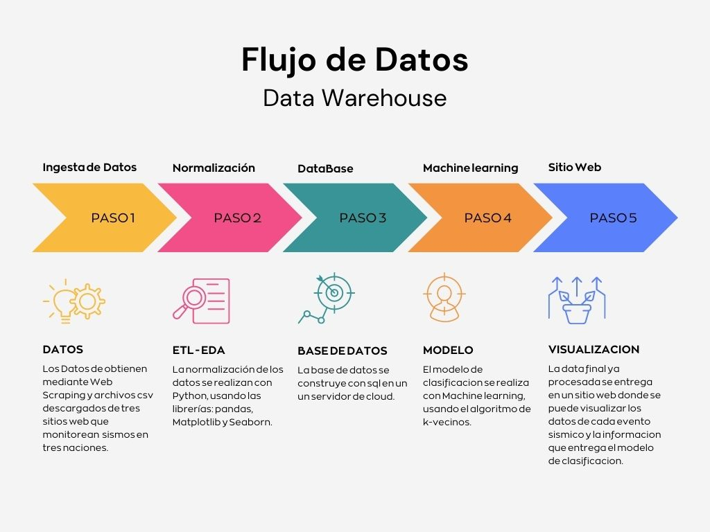

# Clasificador Sismico

 

## Objetivo

Desarrollo de una Herramienta útil para la comunidad en general, por medio de un sistema de clasificación sísmica entregue recomendaciones de seguridad dependiendo de la intensidad.

## Autor

- [Diego Mauro Daniel Maneyro](https://github.com/diegomaneyro)

## Contenido

* **`Readme:`** Aquí encontrará toda la información sobre el sistema clasificador de sismos, objetivos, metas, requerimientos y el alcance. También incluirá cualquier información sobre el proceso de desarrollo y el equipo de trabajo involucrado.
* **`app`**: Sitio Web donde pueden encontrar tanto la información de los sismos como tambien la información entregada por el modelo de Machine Learning.
* **`datos`**: Datasets de tres naciones(EEUU, CHILE, JAPON) que se monitorean, utilizado para entrenar el algoritmo de aprendizaje automático. En este caso, el conjunto de datos se utilizará para entrenar el sistema de clasificación sísmica para luego enviar la información a la población.
* **`Imagenes`**: En esta sección, se incluirán cualquier otro recurso necesario para el proyecto, como imágenes, videos, manuales de usuario, etc.
* **`Modelo`**: Codigo del modelo de clasificacion creado en Machine Learning.
* **`scripts`**: Codigo fuente de la obtención de los datos de los distintos sitios web, normalización de datos y carga automatica para la actualización de los datos.
* **`etl`**: Transformación y normalización de los datos.
* **`eda`**: Exploración de los datos.

## Flujo del Dato

[Skills]("recursos/skill.jpg")

[Desempeño de roles]("recursos/tareas-grafica.jpg")

## Licencia

Este proyecto fue desarrolado bajo la licenia [GPL V3](https://choosealicense.com/licenses/gpl-3.0/) 

La Licencia Pública General de GNU (GPL) es una licencia de software libre diseñada para garantizar la libertad de los usuarios para utilizar, modificar y distribuir software
